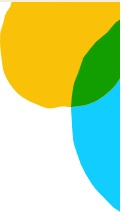

# Trilha de Desenvolvimento — APP Classe IMO (v3)

Registro cronológico de todas as decisões e alterações que levaram à versão final `index-v3.html`.

---

## 1. Diagnóstico da versão anterior (v2)

**Arquivo base:** `index-v2.html` + `css/style-v2.css` + `js/app-v2.js`

**Problemas identificados:**
- Inputs com fundo amarelo puro `#FFFF00` — agressivo visualmente, estética de sistema legado
- Botões com efeito 3D de bisel (`border-bottom: 5px`) — datado
- Separadores de seção com bordas pesadas em todos os lados — sensação de "planilha de papel"
- Escala tipográfica inconsistente (7 tamanhos diferentes: 0.85rem a 1.85rem)
- Banner GAC sem integração visual — parecia um aviso largado
- Resultados aparecendo/sumindo sem transição
- Caixa "Classe do Ativo" com contraste muito duro
- Manipulação direta de DOM via `getElementById` / `textContent` em `app-v2.js`

---

## 2. Decisão tecnológica

**Escolha:** Vue 3 + Tailwind CSS, ambos via CDN (sem build step, sem instalação)

**Descartado:** Next.js (overkill para página estática), React (desnecessário para o escopo atual)

**Preservados intactos:** `js/data.js` e `js/logic.js` — toda a lógica de negócio permaneceu sem alteração.

---

## 3. Criação do `index-v3.html`

### Estrutura Vue 3
- App montado em `<div id="app">` com `v-cloak` (evita flash de template antes da montagem)
- Estado reativo: `ccInput`, `uarInput`, `ccDesc`, `uarDesc`, `resultado`, `showModal`
- Computed: `isIncompat` — verdadeiro quando `resultado.ca === 'Incompatível'`
- Método `val(r, field)` — centraliza o retorno de valores de resultado
- Métodos: `onCCInput`, `onUARInput`, `determinar`, `limpar`, `abrirAjuda`, `fecharAjuda`
- `mounted()` — registra `Escape` para fechar o modal

### Melhorias visuais (Tailwind)
- Inputs: fundo âmbar suave `#fefce8` em vez de amarelo puro
- Botões: flat com `box-shadow` e `transition` suave, sem bisel 3D
- Separadores: `border-slate-200` (1px, leve) com cabeçalhos `bg-slate-50`
- Alerta incompatível: `fade-up` animado ao aparecer
- Modal de ajuda: `fade-up` na entrada

### Correção crítica do modal
**Bug:** o bloco `<div v-if="showModal">` estava posicionado **fora** do `<div id="app">`.
Vue não processava o `v-if`, então o modal aparecia sempre visível e os eventos `@click` não funcionavam.
**Correção:** modal movido para dentro do `#app`, após o card principal.

---

## 4. Ajustes do Topo (Header)

### Redução de altura (−20%)
- `min-height: 64px` → `height: 51px` (64 × 0,8 = 51,2 px)

### Logo dobrado em tamanho
- Logo extraído do fluxo flex do header → `position: absolute; top:0; left:0; z-index:20`
- Tamanho: `w-14 h-14` (56px) → `w-28 h-28` (112px)
- Lógica: logo de 112px em header de 51px seria cortado dentro do flex. Posicionamento absoluto no card resolve o conflito — o logo flutua sobre o topo sem forçar o header a crescer.
- Compensação no corpo: `padding-top: 40px` na seção de inputs (a logo de 112px sobressai 39px abaixo do header+GAC).

### Remoção do fundo branco do logo JPG
- Técnica CSS: `mix-blend-mode: multiply` — pixels brancos somem sobre fundo branco, pixels coloridos preservados.
- Aplicável somente a logos sobre fundo branco.

### Substituição de logo (iteração 1)
- `lgosabesp.jpg` → `logopng.pngbg.png` (PNG com fundo transparente)
- `mix-blend-mode: multiply` removido — desnecessário com PNG transparente

### Substituição de logo (iteração 2 — final)
- `logopng.pngbg.png` → `lgosabesppng2-removebg-preview.png` (PNG com fundo transparente, logo maior e mais nítido)

### Remoção da linha horizontal inferior do header
- Classe `border-b-2 border-sabesp-navy` removida do `<header>`

### Centralização do título em relação às bordas verticais
- Antes: `flex-1 text-center` com `padding-left:124px` → centrava no espaço após o logo, deslocado para a direita
- Depois: `<h1>` com `position: absolute; inset: 0` + `flex items-center justify-center` → centrado sobre toda a largura do card, independente do logo e da imagem decorativa

### Banner GAC
- Removido: bullet `•` (span de ponto decorativo)
- Centralizado: `justify-center` em vez de `padding-left: 128px`
- Alinhamento: centrado nas bordas verticais do card

---

## 5. Alinhamentos de Grid

### TC, TCC, CL centralizados no eixo do campo UAR
- Os valores curtos (`O`, `N`, `0`…) agora usam `<div class="text-center">` dentro da coluna de 155px — mesma largura e alinhamento que o input da UAR.

### Borda esquerda do GB alinhada com a borda direita do CA
- Seção FC/GB/UM: `grid-template-columns: 1fr 1fr 1fr` (33,3% cada) → `30% 1fr 1fr`
- Seção CA/Descrição: `grid-template-columns: 30% 70%` (já estava correto)
- Resultado: borda direita de FC = 30%; borda esquerda de GB = 30% → **segmento de reta único e contínuo** entre as duas seções.

---

## 6. Comportamento dos campos

### Estado inicial / após Limpar → campos em branco
- Método `val(r, field)` alterado: retorna `''` em vez de `'—'` quando não há resultado
- Todos os templates inline (`resultado ? x : '—'`) atualizados para `resultado ? x : ''`

---

## 7. Paleta de cores dos campos

### Primeira versão
- Todos os campos de resultado: `text-red-600` (vermelho) → substituído por `#1E3A5F` (azul escuro)
- Incompatível: `#c0392b` (vermelho)

### Versão final
- Todos os campos de resultado: `#1E3A5F` → substituído por `#00B4D8` (ciano Sabesp)
- Incompatível: `#c0392b` (vermelho) — mantido
- Binding: `:style="{color: isIncompat ? '#c0392b' : '#00B4D8'}"`
- `ccDesc` e `uarDesc`: `style="color:#00B4D8"` (estático, pois não dependem de incompatibilidade)

---

## 8. Arquivos alterados / criados

| Arquivo | Status |
|---|---|
| `index-v3.html` | **Criado** — versão final com Vue 3 + Tailwind |
| `js/data.js` | Intocado |
| `js/logic.js` | Intocado |
| `js/app-v2.js` | Intocado |
| `css/style-v2.css` | Intocado |
| `index-v2.html` | Intocado (versão anterior preservada) |
| `lgosabesppng2-removebg-preview.png` | Referenciado (logo final) |
| `imgemsuperiordireita.jpg` | Referenciado (imagem decorativa superior direita) |

---

## 9. Dependências externas (CDN)

```html
<!-- Vue 3 -->
<script src="https://unpkg.com/vue@3/dist/vue.global.prod.js"></script>

<!-- Tailwind CSS -->
<script src="https://cdn.tailwindcss.com"></script>

<!-- sql.js (SQLite no browser) -->
<script src="https://cdnjs.cloudflare.com/ajax/libs/sql.js/1.10.2/sql-wasm.js"></script>
```

Todas carregadas via CDN — **sem build step, sem npm, sem instalação local**.

---

## 10. Cores de referência do projeto

| Uso | Cor | Hex |
|---|---|---|
| Primária (ciano Sabesp) | Bordas, título, banner | `#00B4D8` |
| Azul escuro (navy) | Borda do card (legada) | `#1A3A5C` |
| Campos de resultado | Valores normais | `#00B4D8` |
| Estado incompatível | Texto e caixa CA | `#c0392b` |
| Fundo input | Âmbar suave | `#fefce8` |
| Texto amarelo (CA box) | Classe do Ativo | `#fde047` |
| Fundo CA box | Azul escuro | `#1a4a6e` |
| Fundo CA incompatível | Vermelho escuro | `#7b1a1a` |

---

## 11. Migração de dados: `data.js` → SQLite

**Motivação:** `js/data.js` embutia ~3.500 linhas de JSON no HTML — carregamento lento e difícil de atualizar.

**Solução:** banco SQLite gerado via `scripts/xlsx_to_sqlite.py`, servido como `db/classes_imo.db` e carregado no browser via **sql.js**.

### Tabelas criadas

| Tabela | Origem | Colunas principais |
|---|---|---|
| `uar` | Aba UAR | `code`, `desc` |
| `cc` | Aba Centros de Custo | `cc`, `responsavel`, `tipo_contrato`, `tipo_centro_custo`, `centro_lucro`, `desc_cc`, `usuario_responsavel` |
| `depara` | Aba DEPARA | `legado`, `atual`, `tipologia_cc`, `up`, `desc_up`, `tipo_contrato`, `forma_controle`, `tipo_bem`, `unid_medida` |

### Fluxo de carregamento no browser

```
initSqlJs() → fetch('db/classes_imo.db') → new SQL.Database(buffer) → db.exec(SQL) → arrays JS
```

- Spinner exibido durante o carregamento (`#loading` com `position:fixed`)
- Em caso de erro (banco não encontrado), mensagem orientando a rodar o script Python
- Banco fechado após extração (`db.close()`) para liberar memória

### Aliases SQL → mesmos nomes do `data.js`

Os campos foram renomeados via `AS` no SELECT para manter compatibilidade total com `js/logic.js`:

```sql
tipo_contrato AS tipoContrato, tipo_centro_custo AS tipoCentroCusto, ...
```

---

## 12. Painel Administrativo (`admin.html`)

**Objetivo:** permitir regenerar o banco SQLite diretamente no browser a partir de um arquivo `.xlsx`, sem depender do Python.

### Funcionalidades

- **Tela de login** — credenciais hardcoded no HTML (uso interno, sem servidor); bloqueia acesso direto ao painel.
- **Barra de sessão** — exibe nome do usuário logado e botão "Sair".
- **Card de consulta idêntico ao `index-v3.html`** — o admin também pode fazer consultas normais.
- **Painel de administração** (abaixo do card) — seção exclusiva com:
  - Upload de arquivo `.xlsx`
  - Geração do banco SQLite no browser via **SheetJS (xlsx)** + **sql.js**
  - Download automático do `classes_imo.db` gerado
  - Indicadores de status (processando, sucesso, erro)

### Fluxo de geração do banco no browser

```
<input file> → FileReader.readAsArrayBuffer() → XLSX.read() 
  → extrai abas UAR / Centros de Custo / DEPARA
  → SQL.Database() → CREATE TABLE + INSERT (em transação única)
  → db.export() → Blob → link de download automático
```

### Credenciais de acesso

Definidas como constante no HTML (uso interno):

```javascript
const CREDENCIAIS = { admin: 'sabesp@2025' };
```

---

## 13. Refatoração do Header (2026-04-17)

**Problema:** header com logo de 112px posicionado de forma absoluta causava sobreposição no conteúdo, exigindo `padding-top: 40px` de compensação no formulário. GAC era uma barra separada com fundo `slate-50`.

**Referência visual:** `layoutfinal01.png`, `layoutfinal02.png`, `layoutfinal03.png`, `hero.png`.

### Mudanças aplicadas

| Elemento | Antes | Depois |
|---|---|---|
| Logo | `lgosabesppng2-removebg-preview.png`, 112px, `position:absolute` | `logopng.png`, 48px (`h-12`), dentro do fluxo do header |
| Header altura | `51px` | `72px` |
| GAC | `<div>` separado com `bg-slate-50` + `border-b` | `<p>` dentro do header, sobre fundo branco |
| Padding formulário | `pt-10` (40px de compensação) | `pt-4` (16px normal) |
| Logo rodapé | `lgosabesp.jpg` | `logopng.png` (consistência) |

### Estrutura do header após refatoração

```html
<header style="height:72px;">
  <!-- Logo: contido no header, sem overflow -->
  

  <!-- Título + GAC: absolutamente centrados -->
  <div class="absolute inset-0 flex flex-col items-center justify-center">
    <h1>Definir a Classe do Ativo</h1>
    <p>GAC: Conformidade de Ativos Regulatórios</p>
  </div>

  <!-- Elemento decorativo -->
  
</header>
```

As mesmas mudanças foram replicadas em `admin.html`.
